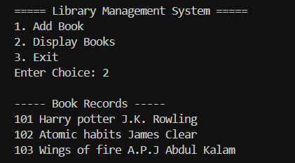

# Library Management System

A simple console-based Library Management System built using C++.

## Features
- Add Books
- Display Books
- File Handling using fstream
- Menu Driven Program

## Technologies Used
- C++
- File Handling
- OOP Concepts

## Project Structure

```plaintext
Library-Management-System/
│
├── main.cpp
├── books.txt
├── README.md
└── screenshots/
```

## Screenshots

### Add Book


### Display Books


## How to Run

```bash
g++ main.cpp -o library
./library
```

## Author
Nihal Agarwal